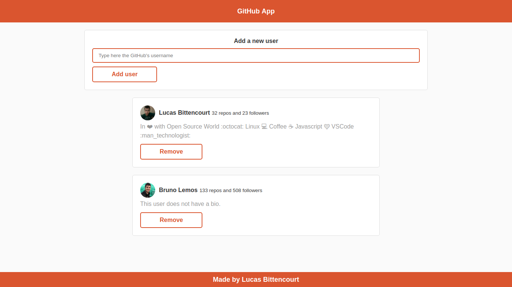
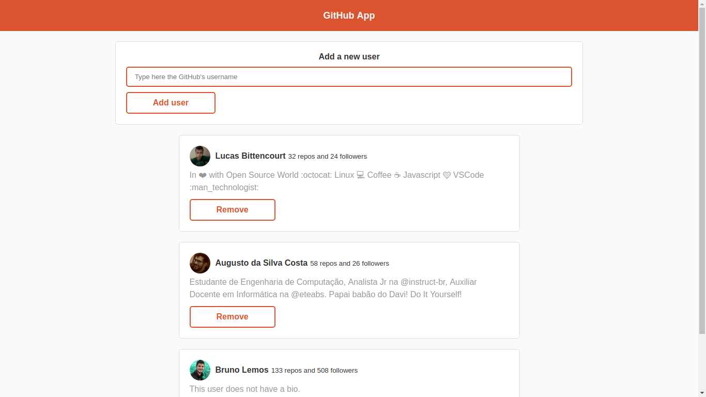

# GitHub App

## Autor: Lucas Bittencourt

### Technologies
- ReactJS
- Node.js
- MongoDB

### How to use
- Install MongoDB
  - `docker container run --name mongodb -p 27017:27017 mongo:latest`
- Type:
  - `yarn`
  - `yarn start`

